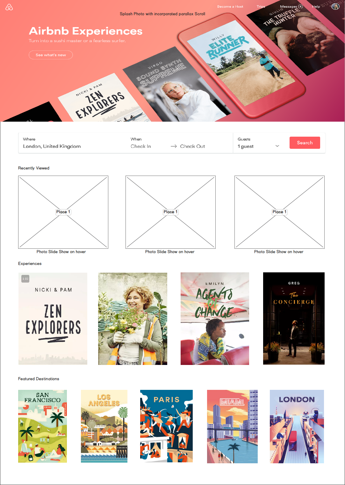

## Airbnb Splash Page Recreation (front-end demo project)

### Background

Airbnb is an online marketplace that allows users to list properties available for rent, as well as search homes to stay at. Starting out as a networking site connecting renters with property owners, Airbnb has recently started to transition into an all inclusive experience site which, along with available listings, has experiences and featured locations. A selling point to Airbnb has been its incredible UI experience. Building off its easy to use interface with aesthetically pleasing design, I decided to recreate the Home Page with several features aimed at enhancing the user's experience by both capturing attention and creating a more dynamic, interactive user interface.

By recreating the home page, I will implement HTML/CSS tricks aimed at enhancing user's experience while encouraging user interaction. In the production README, I will have links to code snippets of the various features.

1) Parallax scrolling over Splash page cover photo
2) Hover effect that plays a slideshow of images associated with a given listing
3) Hover effect that rotates experience page 180 degrees to play video of event
4) Hover effect that causes image to play as gif

### Functionality & MVP  

With this Airbnb Splash Recreation, users will effortlessly interact with various elements of the cover page simply by scrolling:

- [ ] Parallax Scrolling Over Splash Page Cover Photo
- [ ] In "Recently Viewed" section, I will create a hover effect that begins a slideshow of images associated with the given listing (you currently have to click into the page to click on the images to see the slideshow of images)
- [ ] In "Experiences" section, I will create a hover effect that causes the display page to rotate 180 degrees on the y-axis to display video of the experience.
- [ ] In "Featured Destinations", I will create a hover effect that will cause the image go from static to gif. Initially these gifs will be gifs found on giphy. BONUS: create simple gifs of animated city views.
  ex: gif of Miami with Miami lights flashing, gif of London with bus driving into the background

  In addition, this project will include:

- [ ] Links to code snippets of each feature(in the production README)
- [ ] A production README

### Wireframes

This user interactive page will be a recreation of the splash page for Airbnb. In this demo, I will incorporate functionality to make a more dynamic page to entice users to click various regions and explore further.
 With the use of short animated gifs, photo slide shows, and on hover effects, I plan to demonstrate different tactics, created through HTML5, CSS, and Javascript that can be used to increase user response.

### Architecture and Technologies

This project will be implemented with the following technologies:

- Vanilla JavaScript and `jquery` for overall webpage structure and user interaction,
- HTML5 and CSS for styling and implementing CSS tricks
- Webpack to bundle and serve up the various scripts.
- Cloudinary will be used to host images and videos.
- Photoshop and Illustrator to create simple animated gifs for Featured Destinations(BONUS)

### Implementation Timeline

**Day 1**: Setup all necessary Node modules, including getting webpack up and running and  installed.  Create `webpack.config.js` as well as `package.json`.    Goals for the day:

- Get general layout of webpage set with splash photo, "recently viewed" section, "experiences" section, and "featured destinations" section
- Create a parallax scroll effect over the splash photo

**Day 2**: Dedicate the day to learning how to start a video slideshow on hover for the "Recently Viewed" section.  Also, learn how to attach videos in HTML form for the "Experiences" section.
Goals for the day:

- Functioning slideshow
- Attached videos that will start and stop on hover

**Day 3**: Create a rotation effect when the "Experiences" are hovered over. This should rotate the experience 180 degrees and begin to play the video corresponding with the experience.
Goals for the day:

- Create y-axis rotation effect on each of the experiences
- Have associated video begin to play on rotation

**Day 4**: In the "Featured Destinations" section, add a hover effect that will cause the gif to begin to play.
Goals for the day:

- Create hover effect on gifs so that they begin to play and "come to life"
- Create own simple gif using Photoshop and Illustrator
- Begin on other bonus features

### Bonus features

There are many possible areas of improvement for creating a more interactive UI. Some future directions include:

- [ ] Create own gif for "Featured Destinations" section using Photoshop/ Illustrator
- [ ] Continuously playing video for cover splash photo
- [ ] "Feature destinations" section links to popular attractions in the area rather than listings :)
